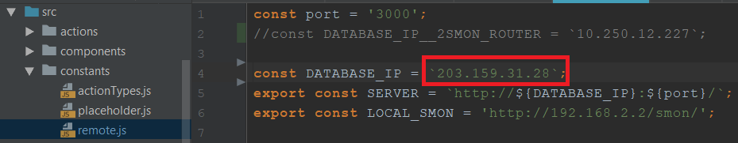
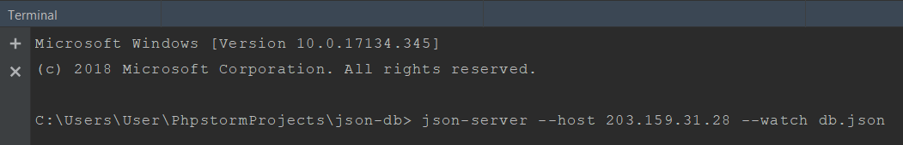

#JSON Server for Baengpun Mobile Application 
(Oct 12 2018)
##Install

Clone
   
    https://github.com/mixxa12345/json-db.git
    
    https://github.com/padillareyj/banpan-mobile.git

Command

    json-server --host [ IP ADDRESS ] --watch [ DB FILE ]
    
    
Example
    
    IP -> 203.159.31.28
    File -> db.json
    Command -> json-server --host 203.159.31.28 --watch db.json
    
    
    
 banpan-mobile/src/constants/remote.js -> DATABASE_IP must same as IP in command 

prompt in command line

